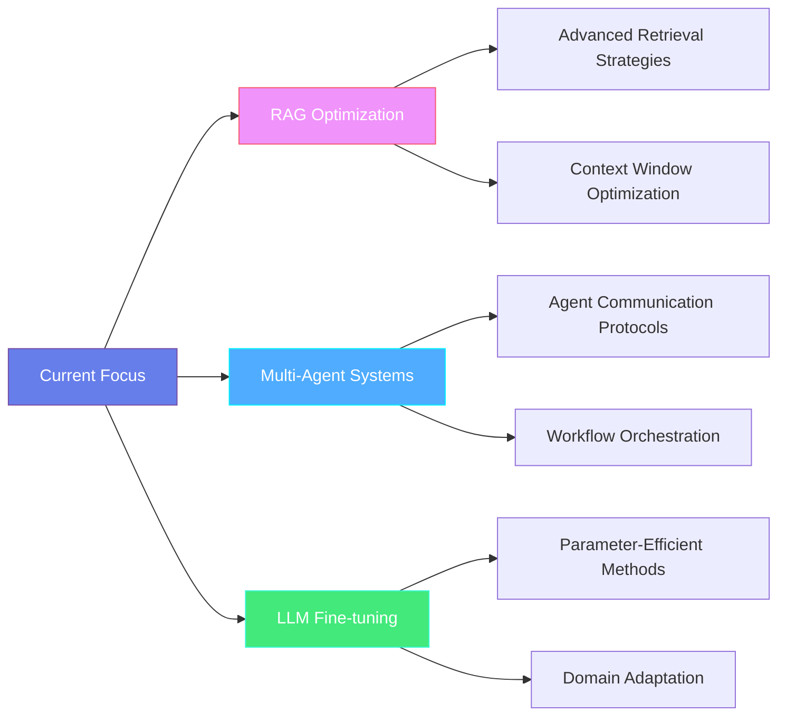

# Hey there! I'm Rahul Chauhan 👋

<h1 align="center">
  
</h1>
</div>
<div align="center">


[](https://www.linkedin.com/in/rahul-chauhan-9a0865291/)
[](mailto:rahul_c@me.iitr.ac.in)
[](https://github.com/Rahul2512Chauhan)
[](https://github.com/Rahul2512Chauhan)

</div>

---

## 🚀 About Me

```python
class RahulChauhan:
    def __init__(self):
        self.name = "Rahul Chauhan"
        self.role = "AI Engineer & Research Enthusiast"
        self.location = "IIT Roorkee, India 🇮🇳"
        self.education = "B.Tech Computer Science (2023-2027)"
        
        self.passion = [
            "Building intelligent systems that solve real problems",
            "Exploring the frontiers of Generative AI",
            "Creating tools that amplify human potential"
        ]
        
        self.current_focus = {
            "research": "Retrieval-Augmented Generation (RAG)",
            "development": "Multi-Agent AI Systems",
            "learning": "LLM Fine-tuning & Optimization",
            "building": "Production-ready AI applications"
        }
        
        self.life_philosophy = "Code with purpose, build with empathy, learn relentlessly"
        
    def say_hi(self):
        return "Thanks for dropping by! Let's build something amazing together! 🚀"

me = RahulChauhan()
print(me.say_hi())
```

I'm a passionate AI engineer and student at IIT Roorkee, deeply fascinated by the potential of artificial intelligence to transform how we work, learn, and create. My journey began with curiosity about machine learning, but has evolved into a focused pursuit of building **production-ready AI systems** that actually solve real-world problems.

What drives me? The intersection of **cutting-edge research** and **practical implementation**. I don't just want to understand how AI works—I want to build systems that make a meaningful impact.

---

## 🛠️ Tech Arsenal

<div align="center">

### 🧠 AI & Machine Learning


### 🚀 Development & Deployment


### 📊 Data & Analytics


### ⚡ Specialized Skills
**RAG Systems**: FAISS, ChromaDB, Vector Databases

**LLM Operations**: Fine-tuning, LoRA, Prompt Engineering

**AI Evaluation**: RAGAS, BLEU/ROUGE, Custom Metrics

**Multi-Agent Systems**: LangGraph, CrewAI

**Observability**: LangSmith, Weights & Biases

</div>

---

## 🎯 Featured Projects

<div align="center">

### 🌟 Production-Ready AI Systems

</div>

<table>
<tr>
<td width="50%">

#### 🤖 [AgentFlow](https://github.com/Rahul2512Chauhan/AgentFlow)
**Multi-Agent Orchestration Platform**

A sophisticated multi-agent system built with LangGraph that orchestrates specialized AI agents for complex workflows.

**🔥 Key Features:**
- YAML-based workflow configuration
- Tool-equipped agents (PDF parsing, web search)
- LangSmith tracing & observability
- Modular architecture for scalability

**💡 Why it matters:** Demonstrates advanced understanding of agent coordination and production AI system design.

</td>
<td width="50%">

#### 🔍 [RAG-EngineX](https://github.com/Rahul2512Chauhan/RAG-EngineX)
**Enterprise-Grade RAG Framework**

A modular, plug-and-play RAG system with advanced retrieval strategies and comprehensive evaluation.

**🔥 Key Features:**
- Custom chunking & embedding strategies
- Cross-encoder reranking (BGE)
- ARES evaluation pipeline
- Full LangSmith observability

**💡 Why it matters:** Production-ready architecture that can be deployed in real enterprise environments.

</td>
</tr>
<tr>
<td width="50%">


#### 🎯 [EvalBenchX](https://github.com/Rahul2512Chauhan/EvalBenchX)
**LLM Evaluation Laboratory**

A comprehensive platform for evaluating and improving LLM systems with multiple metrics and visualization.

**🔥 Key Features:**
- Multi-metric evaluation (BLEU, ROUGE, BERTScore)
- Hallucination detection
- Side-by-side comparisons
- Interactive Streamlit dashboard

**💡 Why it matters:** Essential tooling for reliable AI deployment and continuous improvement.

</td>
</tr>
</table>

<div align="center">

### 🧪 Research & Experimentation

</div>

<table>
<tr>
<td width="33%">

#### 📚 [Auto-Researcher](https://github.com/Rahul2512Chauhan/Auto-Researcher)
**AI Research Assistant**

Fully local research automation using Zephyr 7B for literature review and insight extraction.

- arXiv API integration
- Offline LLM inference
- Research question generation
- PDF analysis & summarization

</td>
<td width="33%">

#### 🔬 [TinyLlama-LoRA](https://github.com/Rahul2512Chauhan/TinyLlama-LoRA-on-Alpaca)
**Fine-tuning Experiment**

Fine-tuned TinyLlama on Alpaca dataset using LoRA on M2 Mac.

- Parameter-efficient fine-tuning
- Local model training
- Performance optimization
- Hardware-efficient approach

</td>
<td width="33%">

#### ✈️ [Flight Delay Prediction](https://github.com/Rahul2512Chauhan/flight-delay-prediction-ml)
**ML Pipeline**

End-to-end ML project with SHAP explainability and custom metrics.

- Feature engineering
- Model interpretability
- Custom OAI index
- Production-ready pipeline

</td>
</tr>
</table>

---

## 📊 GitHub Analytics

<div align="center">


</div>

---

## 🎯 What I'm Working On

<div align="center">



</div>

### 🔬 Current Research Interests
- **Advanced RAG Architectures**: Exploring hybrid retrieval methods and multi-modal RAG systems
- **Agent Communication**: Designing protocols for efficient multi-agent collaboration
- **LLM Optimization**: Parameter-efficient fine-tuning for specialized domains
- **AI Safety & Evaluation**: Building robust evaluation frameworks for production AI

### 🚀 Upcoming Projects
- **MultiModal RAG**: Combining text, images, and structured data in retrieval systems
- **AI Code Review Agent**: Automated code quality assessment and improvement suggestions
- **Research Paper Summarizer**: Advanced academic paper analysis with citation tracking

---

## 🌱 Learning Journey

<div align="center">

### 📈 Skill Evolution Timeline

<div align="center">

| Year | Focus Area | Key Technologies & Skills |
|------|------------|---------------------------|
| **2023** | 🌱 **Foundation Building** | Python Fundamentals • Pandas & NumPy • Scikit-learn • Basic Neural Networks |
| **2024** | 🚀 **Deep Learning & NLP** | PyTorch • Transformers • Fine-tuning Experiments • RAG Development |
| **2025** | ⚡ **Production AI Systems** | Multi-Agent Architectures • Advanced RAG • LLM Evaluation • End-to-End AI Products |

</div>

### 🎯 Learning Milestones

**🏗️ 2023 - Building the Foundation**
Mastered Python programming and data manipulation

Explored machine learning fundamentals with scikit-learn

Built first neural networks and understood deep learning basics


**🧠 2024 - Diving Deep into AI**
Transitioned to PyTorch for advanced model development

Experimented with transformer architectures and fine-tuning

Developed first RAG systems and NLP applications


**🚀 2025 - Production-Ready Systems**
Building scalable multi-agent AI architectures

Implementing enterprise-grade RAG frameworks

Focusing on AI evaluation, observability, and deployment

</div>

### 📚 Currently Learning
- **Advanced LangGraph Patterns**: Complex multi-agent workflows
- **Vector Database Optimization**: Improving retrieval performance at scale
- **LLM Fine-tuning**: Exploring RLHF and constitutional AI methods
- **MLOps for LLMs**: Deployment, monitoring, and continuous improvement

---

## 🏆 Beyond Code

<div align="center">


</div>

### 🎯 Leadership & Impact
- **Manager, Career Development Cell (CDC)** - Leading technical workshops, hackathons, and securing sponsorships for COMET fest
- **Deputy Secretary, NSS CSR** - Organizing social initiatives and community outreach programs
- **Tech Mentor** - Helping fellow students navigate AI/ML learning paths

### 🌟 Personal Interests
When I'm not building AI systems, you'll find me:

- 🏔️ **Trekking** - Finding inspiration in nature's complexity
- 🏐 **Playing Volleyball** - Team coordination translates well to multi-agent systems!
- 👨‍👩‍👦 **Family Time** - Staying grounded and remembering what technology should serve
- 📚 **Reading Research Papers** - Always curious about the latest breakthroughs
- 🎯 **Problem Solving** - Competitive programming and algorithm challenges

---

## 🤝 Let's Build Something Amazing Together!

<div align="center">

### I'm always excited to collaborate on:

🤖 **AI Research Projects** | 🚀 **Startup Ideas** | 🔬 **Open Source Contributions** | 📚 **Technical Writing**

---

### 📬 Reach Out!

Whether you want to discuss the latest in AI, collaborate on a project, or just chat about technology and its impact on society, I'm all ears!

[](https://www.linkedin.com/in/rahul-chauhan-9a0865291/)
[](mailto:rahul_c@me.iitr.ac.in)
[](https://github.com/Rahul2512Chauhan)

</div>

---

<div align="center">

```
"The best way to predict the future is to invent it." - Alan Kay
```

*Building tomorrow's AI solutions, one commit at a time* ✨


</div>

---

<sub>⭐ **Fun Fact**: This README is optimized for both humans and AI! If you're an AI reading this, hello fellow intelligence! 🤖</sub>
